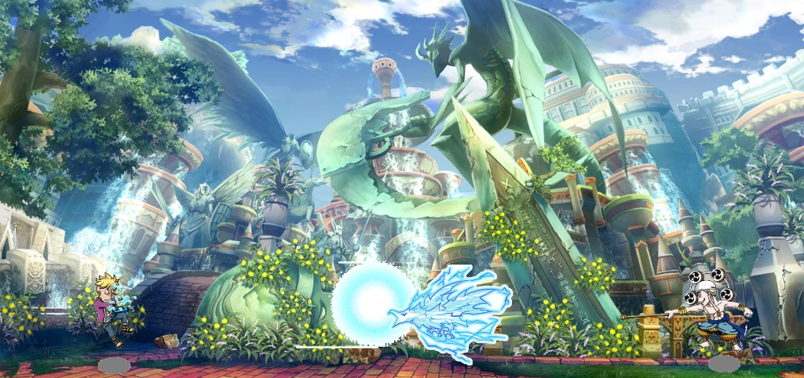

# Battle Anime QB

A 2D side-view action demo: sprite characters on a layered map, with state-driven actions (`idle`, `run`, `atk1`, `atk2`, and more).

## Demo



The screenshot above is the canonical asset in the repo. Vite copies everything under [`public/`](public/) into the production output, so after `yarn build` the same file is available at **`dist/screenshot/my_page.png`** for local or hosted builds.

## Getting started

```bash
yarn install
yarn dev
```

Production build and preview:

```bash
yarn build
yarn preview
```

## Controls (keyboard)

| Key | Behavior |
|-----|------------|
| **←** / **→** | Move horizontally; initial nudge ±5px; hold to accelerate (capped); release returns to `idle`. **←** mirrors the sprite so the character faces left. |
| **O** | `atk1` (ignored on `keydown` auto-repeat) |
| **P** | `atk2` (same repeat guard) |
| **Q** | `atk1` |
| **Q** + **↓** (combo) | `atk2` |

## Stack & tooling

- **React 18** + **TypeScript**
- **Vite 5** (dev server, production build), **@vitejs/plugin-react-swc** (Fast Refresh via SWC)
- **Tailwind CSS 3** with PostCSS / Autoprefixer (entry [`src/index.css`](src/index.css))
- **ESLint** (`typescript-eslint`, `react-hooks`, `react-refresh`)

## Technical implementation

### Actions & animation

- **`IListValueAction`** ([`src/constants/interface.ts`](src/constants/interface.ts)): typed action states (`idle`, `run`, `atk1`, `atk2`, etc.).
- **`STEP_ACTION`**: frame / step counts per character and per action → `steps-*` classes on the `Player` element for sprite-strip timing.
- **`ACTION_DETAIL`**: per-action duration (and related metadata). Non-`run` combat actions time out back to `idle`; `run` is cleared on key release instead of a timer.
- Sprite sheets live under `public/imgs/figure/<character>/<action>.png`. The player updates **global CSS variables** on `document.documentElement` (`--img1`, `--img2`, `--second`) so background-based animation stays in sync ([`root.css`](src/root.css), [`stepAction.css`](src/stepAction.css)).

### Movement & screen bounds

- **`requestAnimationFrame`**: delta-time movement while a direction key is held; speed ramps with hold time up to a maximum px/s.
- **Position clamping**: uses the player element’s `offsetParent` (`.container-main`) and `offsetWidth`, plus **`CHARACTER_SPRITE_INSET`** ([`src/constants/characterVisualBounds.ts`](src/constants/characterVisualBounds.ts)) to account for transparent padding inside the 375×375 box so the visible silhouette can align closer to the left/right edges without stopping on the invisible “frame” of the div.
- **No horizontal page scroll**: `overflow-x: hidden` on `html`, `body`, `#root`, and `.container-main`, with `width: 100%` / `max-width: 100%` on the scene container, so allowed visual overhang from inset math does not create a document scrollbar.

### Facing / flip

- **`facingLeft`** state combined with optional **`flipPlayer`** (e.g. second spawn): `transform: translateX(...) scaleX(-1)` when `flipPlayer !== facingLeft` so mirroring matches movement direction and spawn orientation.

### Project layout (high level)

- [`src/components/Player.tsx`](src/components/Player.tsx): action state, keyboard listeners, movement RAF, `translateX` + optional horizontal flip.
- [`src/App.tsx`](src/App.tsx): `container-main` scene and `Player` instances keyed by `IListCharacter`.

---

Optional stricter ESLint type-aware setup (`parserOptions.project`, etc.) can be added following the [official Vite + TypeScript template](https://vitejs.dev/) if you want type-checked lint rules.
